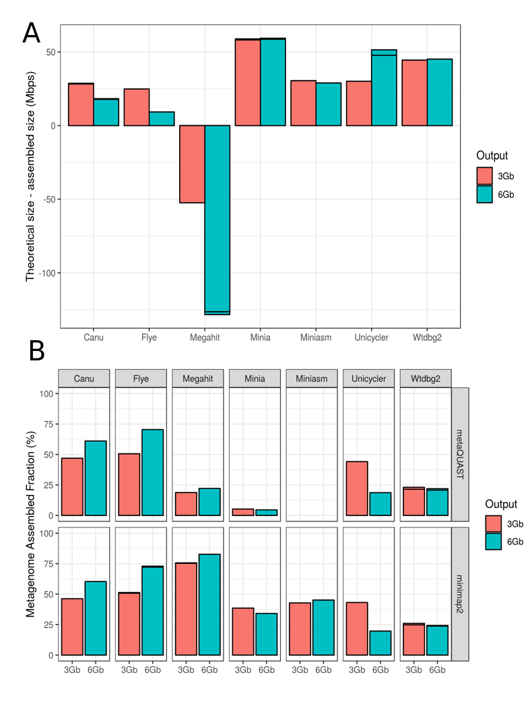
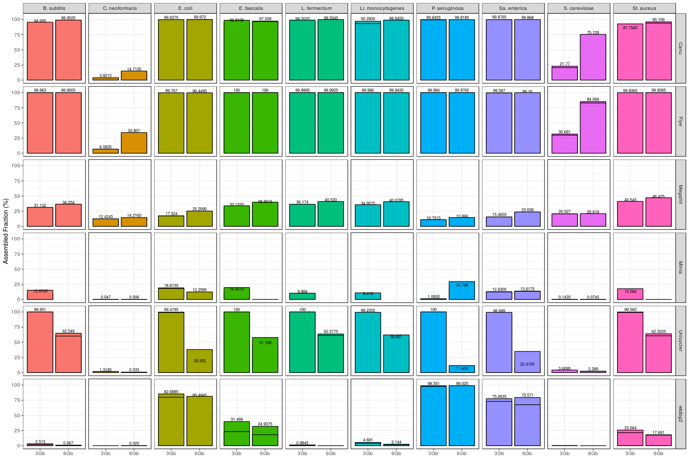
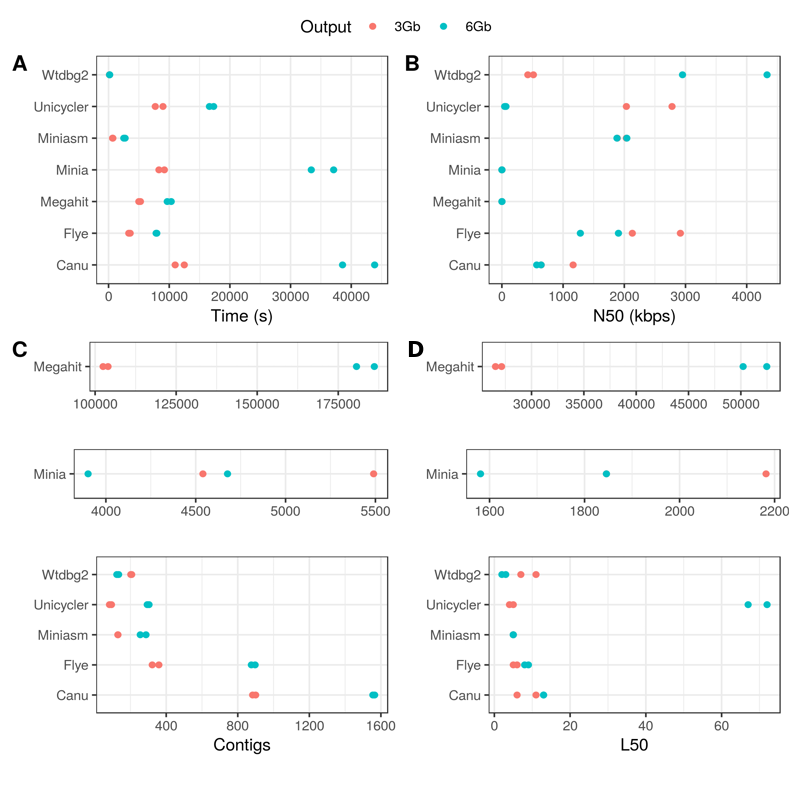
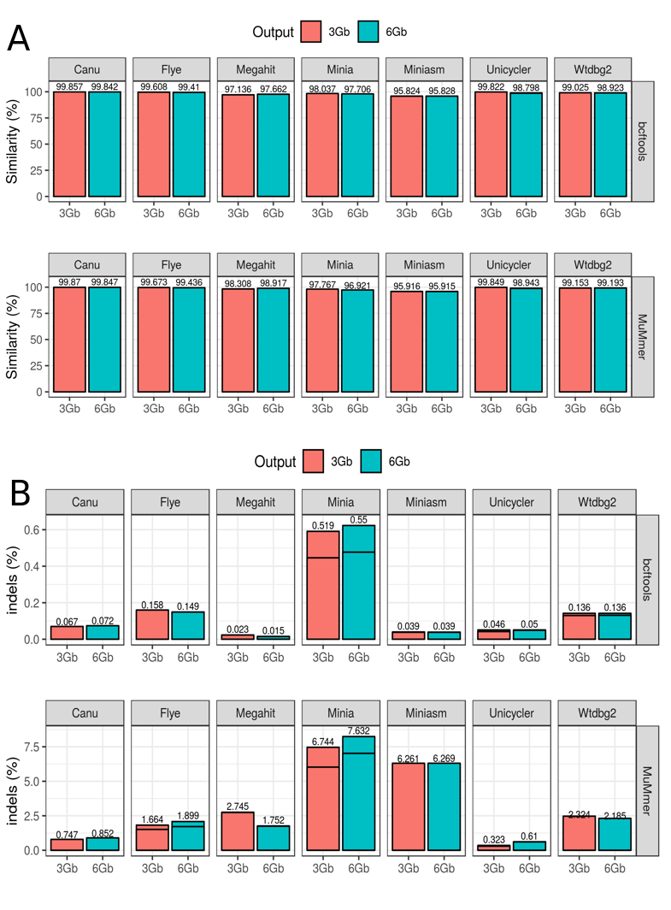
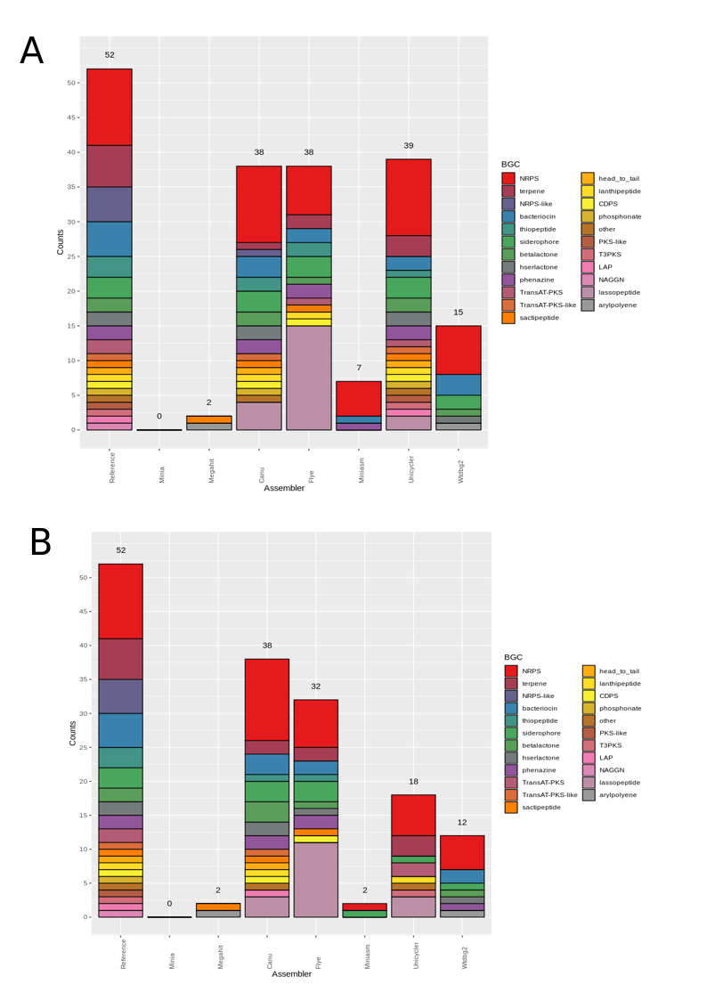
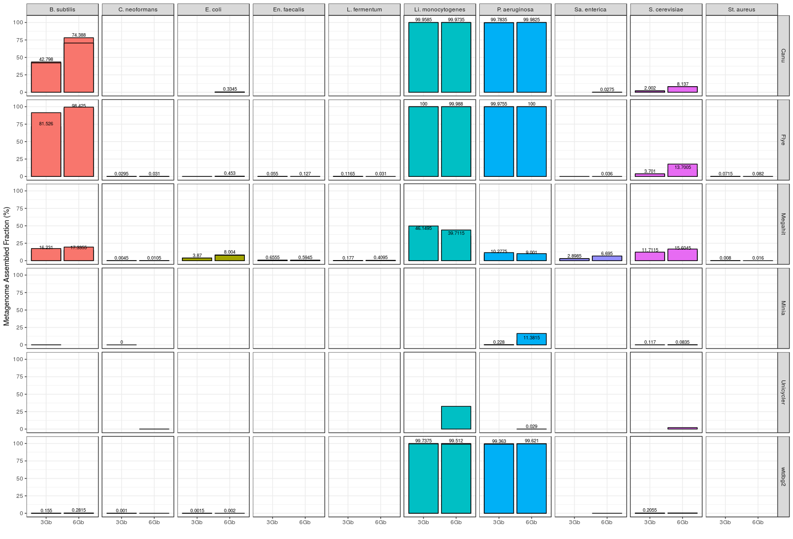
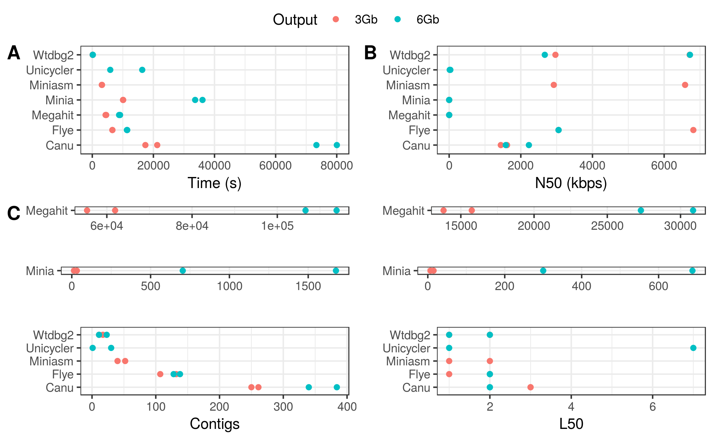
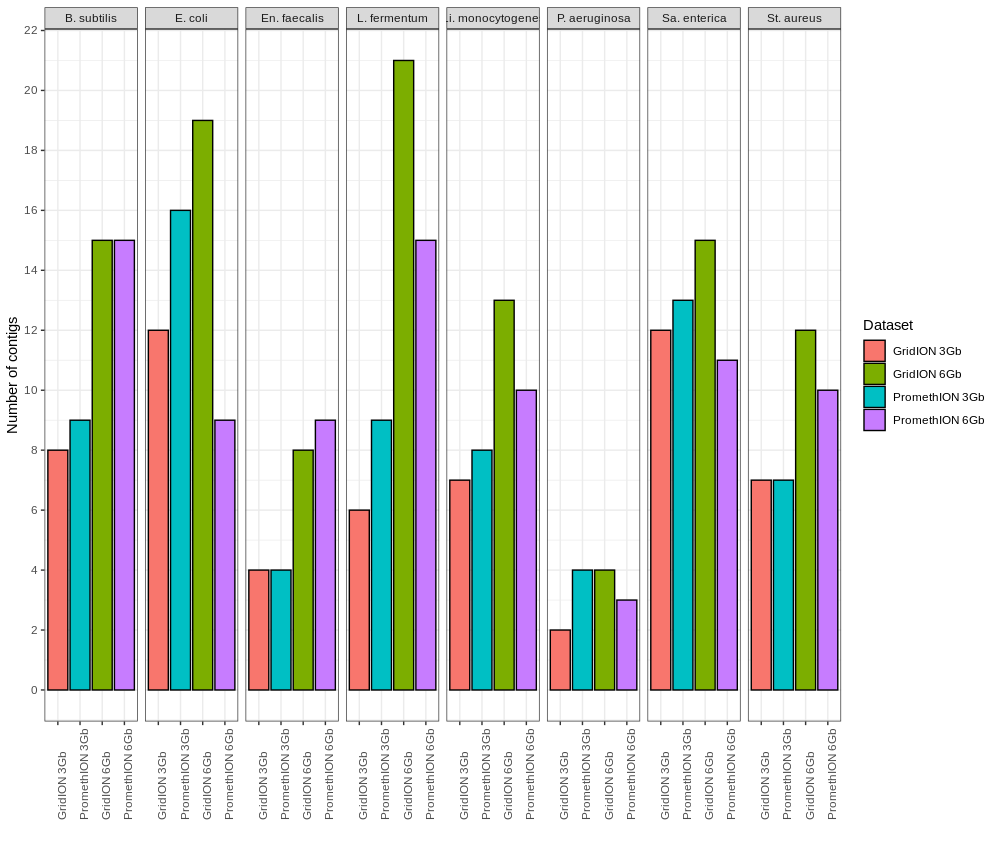

# Assembly methods for nanopore-based metagenomic sequencing: a comparative study

This repository is intended to mantain and update the data of our work ["Assembly methods for nanopore-based metagenomic sequencing: a comparative study"](https://www.biorxiv.org/content/10.1101/722405v1.full), and to include all the suppplementary files and scripts used. 

We are currently working in an update of the benchmarking, which will include new assemblers and figures. Results will be deposited in this repository as soon as possible.

For a full discussion of the current results, please visit the [bioRxiv preprint](https://www.biorxiv.org/content/10.1101/722405v1.full).

Stay tuned!

## Workflow (spoiler alert!)

For impatient people: this is our personal pipeline recommendation for metagenomic assembly based on ONT sequences. The workflow could change by the time we perform new evaluations including different assemblers or data.

It has to be noted that we strongly recommend to try different assemblers on your data in order to get a broader spectrum of what's in your samples!

**Recommended ONT metagenomic assembly workflow**. *Based on August, 2019 evaluation*.

## Figures

**Figure 1.** Evaluation of metagenome assembly size corresponding to each tested tool for the Even datasets. (A) Total assembled size of draft assemblies with respect to the total size of the reference metagenome; (B) Fraction of the reference metagenome covered by the draft assembly, calculated by two different methods: metaQUAST (up) and minimap2 + BBTools (down). *Note: the reason of applying two different methods in (B) is that metaQUAST failed to run the miniasm data for unkown reasons*.

**Figure 2.** Fraction of genome covered by draft assemblies obtained with each tool, and for each individual microorganism (Even datasets). *Note: Minimap2 + miniasm assemblies are not shown, since it was not possible to evaluate them with metaQUAST*.

**Figure 3.** General assembly performance of each tool for the Even datasets. (A) Run time; (B) N50; (C) Number of contigs; (D) L50.

**Figure 4.** Assembly accuracy for the draft assemblies in the Even datasets. (A) Percentage of similarity calculated as the total number of matches normalized by the metagenome size; (B) Percentage of INDELs calculated as the total number of INDELs normalized by the metagenome size. In both cases, two different strategies were used: (1) alignment with minimap and evaluation with bcftools + ‘indels_and_snps.py’ in-house script; (2) alignment with MuMMer and evaluation with ‘count_SNPS_indels.pl’ script from Goldstein et al. (2019).

**Figure 5.** Number of biosynthetic gene clusters (BGCs) predicted by antiSMASH for each draft assembly in the Even GridION datasets. (A) BGCs predicted for the 3 Gbps dataset; (B) BGCs predicted for the 6 Gbps dataset.

## Supplementary Figures

**Figure S1.** Fraction of genome covered by draft assemblies obtained with each tool, and for each individual microorganism (Log datasets). Minimap2 + miniasm assemblies are not shown, since it was not possible to evaluate them with metaQUAST.

**Figure S2.** General assembly performance of each tool for the Log datasets. (A) Run time; (B) N50; (C) Number of contigs; (D) L50.

**Figure S3.** Number of contigs for each bacterial genome retrieved by Flye for the Even datasets.

## Supplementary tables

**Table S1**. Canu’s basic assembly statistics for the GridION datasets.

|                           |         | 3Gb         |     |         | 6Gb         |     |
|---------------------------|---------|-------------|-----|---------|-------------|-----|
|                           | Contigs | N50         | L50 | Contigs | N50         | L50 |
| *Bacillus subtilis*       | 34      | 298,071.0   | 5   | 17      | 655,353.0   | 3   |
| *Enterococcus faecalis*   | 13      | 388,478.0   | 3   | 10      | 747,976.0   | 3   |
| *Escherichia coli*        | 5       | 2,669,962.0 | 1   | 6       | 4,941,166.0 | 1   |
| *Lactobacillus fermentum* | 13      | 402,806.0   | 2   | 14      | 4,941,166.0 | 1   |
| *Listeria monocytogenes*  | 18      | 4,942,769.0 | 1   | 14      | 2,747,940.0 | 2   |
| *Pseudomonas aeruginosa*  | 3       | 5,593,153.0 | 1   | 4       | 2,747,940.0 | 2   |
| *Salmonella enterica*     | 3       | 4,942,769.0 | 1   | 11      | 2,075,612.0 | 2   |
| *Staphylococcus aureus*   | 17      | 769,443.0   | 2   | 17      | 640,396.0   | 3   |

**Table S2**. Flye’s basic assembly statistics for the GridION datasets.

|                           |         | 3Gb         |     |         | 6Gb         |     |
|---------------------------|---------|-------------|-----|---------|-------------|-----|
|                           | Contigs | N50         | L50 | Contigs | N50         | L50 |
|  *Bacillus subtilis*      | 8       | 4,121,094.0 | 1   | 15      | 4,118,946.0 | 1   |
| *Enterococcus faecalis*   | 4       | 2,916,346.0 | 2   | 8       | 2,917,992.0 | 1   |
|  *Escherichia coli*       | 12      | 686,395.0   | 2   | 19      | 1,282,129.0 | 2   |
| *Lactobacillus fermentum* | 6       | 1,916,903.0 | 1   | 21      | 1,909,954.0 | 1   |
| *Listeria monocytogenes*  | 7       | 2,990,853.0 | 1   | 13      | 2,129,318.0 | 1   |
| *Pseudomonas aeruginosa*  | 2       | 6,821,368.0 | 1   | 4       | 6,820,234.0 | 1   |
| *Salmonella enterica*     | 12      | 1,848,158.0 | 2   | 15      | 1,282,129.0 | 2   |
| *Staphylococcus aureus*   | 7       | 2,783,558.0 | 1   | 12      | 2,785,527.0 | 1   |

These two tables clearly show that the combination of Canu and Flye could help to recovery all the genomes with a high degree of contiguity. As an example, *B. subtilis* genome is well recovered by Flye (3 and 6 Gbps datasets), but not by Canu. However, Canu clearly recovered  better *E. coli*'s genome than Flye.
